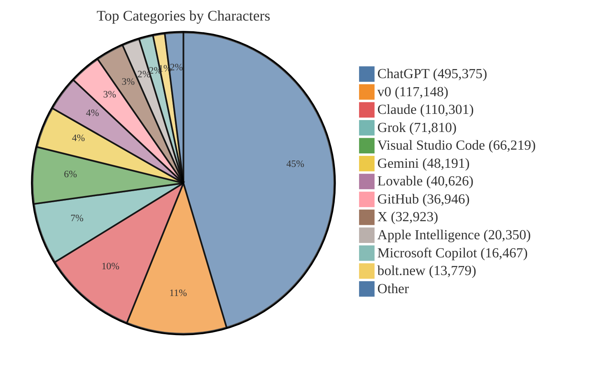
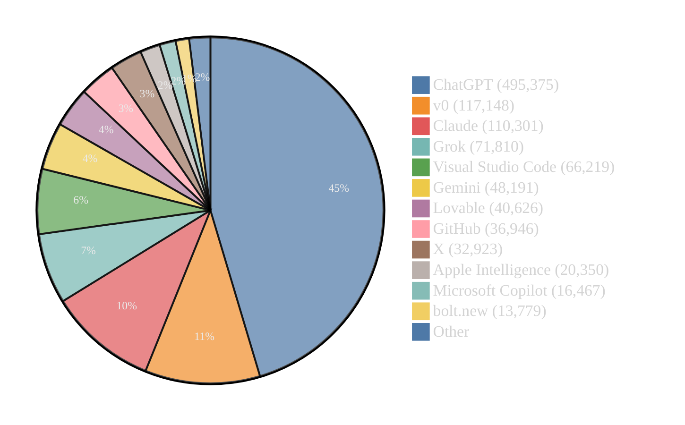

# Prompt Stats

**Generated:** 2025-12-20T08:00:18.292Z

## Summary

- **Total prompts:** 185
- **Total characters:** 1,091,639
- **Total lines:** 16,784
- **Top category:** ChatGPT (495,375 chars in 74 prompts)

## Markers

- 🆕 New Prompt (shown as "+" in bar charts)
- ✨ Recently Updated (shown as "*" in bar charts)

_Markers appear next to names in lists and charts._

---

## Top Categories by Characters

<details open><summary>List</summary>

```text
ChatGPT                    74 prompts      495,375 chars
v0                          2 prompts      117,148 chars
Claude                      2 prompts      110,301 chars
Grok                       17 prompts       71,810 chars
Visual Studio Code         19 prompts       66,219 chars
Gemini                     13 prompts       48,191 chars
Lovable                     1 prompts       40,626 chars
GitHub                      2 prompts       36,946 chars
X                           7 prompts       32,923 chars
Apple Intelligence         37 prompts       20,350 chars
Microsoft Copilot           1 prompts       16,467 chars
bolt.new                    3 prompts       13,779 chars
Other                       7 prompts       21,504 chars
```

</details>

<details><summary>Pie Chart (Light Theme)</summary>


```mermaid
%%{init: {"theme": "base", "themeVariables": {"fontFamily":"Inter, Segoe UI, Roboto, Helvetica, Arial, sans-serif","pieTitleTextSize":"18px","pieSectionTextSize":"12px","pie1":"#4E79A7","pie2":"#F28E2B","pie3":"#E15759","pie4":"#76B7B2","pie5":"#59A14F","pie6":"#EDC948","pie7":"#B07AA1","pie8":"#FF9DA7","pie9":"#9C755F","pie10":"#BAB0AC","pie11":"#86BCB6","pie12":"#F1CE63"} } }%%
pie title Top Categories by Characters
  "ChatGPT (495,375)" : 495375
  "v0 (117,148)" : 117148
  "Claude (110,301)" : 110301
  "Grok (71,810)" : 71810
  "Visual Studio Code (66,219)" : 66219
  "Gemini (48,191)" : 48191
  "Lovable (40,626)" : 40626
  "GitHub (36,946)" : 36946
  "X (32,923)" : 32923
  "Apple Intelligence (20,350)" : 20350
  "Microsoft Copilot (16,467)" : 16467
  "bolt.new (13,779)" : 13779
  "Other" : 21504
```

</details>

<details><summary>Pie Chart (Dark Theme)</summary>


```mermaid
%%{init: {"theme": "dark", "themeVariables": {"background":"transparent","textColor":"#EAEAEA","primaryTextColor":"#EAEAEA","pieTitleTextColor":"#FFFFFF","pieSectionTextColor":"#EAEAEA","fontFamily":"Inter, Segoe UI, Roboto, Helvetica, Arial, sans-serif","pieTitleTextSize":"18px","pieSectionTextSize":"12px","pie1":"#4E79A7","pie2":"#F28E2B","pie3":"#E15759","pie4":"#76B7B2","pie5":"#59A14F","pie6":"#EDC948","pie7":"#B07AA1","pie8":"#FF9DA7","pie9":"#9C755F","pie10":"#BAB0AC","pie11":"#86BCB6","pie12":"#F1CE63"} } }%%
pie title Top Categories by Characters
  "ChatGPT (495,375)" : 495375
  "v0 (117,148)" : 117148
  "Claude (110,301)" : 110301
  "Grok (71,810)" : 71810
  "Visual Studio Code (66,219)" : 66219
  "Gemini (48,191)" : 48191
  "Lovable (40,626)" : 40626
  "GitHub (36,946)" : 36946
  "X (32,923)" : 32923
  "Apple Intelligence (20,350)" : 20350
  "Microsoft Copilot (16,467)" : 16467
  "bolt.new (13,779)" : 13779
  "Other" : 21504
```

</details>

## Top Prompts by Characters

**Top Prompts by Characters**

```text
  ChatGPT/ChatGPT 5 Thinking/prompt.txt                        | ████████████████████████████████████████ 71,159 chars
  ChatGPT/ChatGPT 5 Thinking mini/prompt.txt                   | ███████████████████████████████████ 61,874 chars
+ ChatGPT/ChatGPT 5.2/prompt.txt                               | █████████████████████████████████ 59,545 chars
  v0/Project/prompt.txt                                        | █████████████████████████████████ 59,302 chars
  Claude/Claude Sonnet 4/prompt.txt                            | █████████████████████████████████ 58,930 chars
  v0/Chat/prompt.txt                                           | █████████████████████████████████ 57,846 chars
  Claude/Claude 3.5 Sonnet/prompt.txt                          | █████████████████████████████ 51,371 chars
  Lovable/prompt.txt                                           | ███████████████████████ 40,626 chars
  ChatGPT/ChatGPT 5/prompt.txt                                 | ████████████████████ 35,420 chars
  ChatGPT/ChatGPT 5 Fast/prompt.txt                            | ███████████████████ 34,043 chars
  ChatGPT/ChatGPT o3/prompt.txt                                | ██████████████████ 32,191 chars
  ChatGPT/Agent/prompt.txt                                     | ████████████████ 27,955 chars
  Gemini/Canvas.txt                                            | ███████████████ 26,270 chars
  ChatGPT/Chain-of-Thought/OpenAI o3/prompt.txt                | █████████████ 22,854 chars
  GitHub/Copilot/Home/prompt.txt                               | ████████████ 20,870 chars
  ChatGPT/Study/prompt.txt                                     | ██████████ 16,951 chars
  Microsoft Copilot/prompt.txt                                 | █████████ 16,467 chars
  GitHub/Copilot/Spaces/prompt.txt                             | █████████ 16,076 chars
  Visual Studio Code/GitHub Copilot/Chat/Extensions/github.txt | █████████ 16,013 chars
  ChatGPT/GPT Builder/prompt.txt                               | ████████ 14,407 chars
  Grok/Expert/prompt.txt                                       | ████████ 13,753 chars
  X/Expert/prompt.txt                                          | ████████ 13,472 chars
  bolt.new/prompt.txt                                          | ████████ 13,403 chars
  ChatGPT/ChatGPT Tasks/prompt.txt                             | ███████ 12,365 chars
  ChatGPT/Project/prompt.txt                                   | ███████ 12,211 chars
```

## Top Prompts by Lines

**Top Prompts by Lines**

```text
  Lovable/prompt.txt                                           | ████████████████████████████████████████ 1,186 lines
  ChatGPT/ChatGPT 5 Thinking/prompt.txt                        | ███████████████████████████████████████ 1,159 lines
  v0/Project/prompt.txt                                        | ███████████████████████████████████████ 1,154 lines
  v0/Chat/prompt.txt                                           | ██████████████████████████████████████ 1,113 lines
  ChatGPT/ChatGPT 5 Thinking mini/prompt.txt                   | ███████████████████████████████████ 1,034 lines
+ ChatGPT/ChatGPT 5.2/prompt.txt                               | ██████████████████████████████ 894 lines
  Claude/Claude 3.5 Sonnet/prompt.txt                          | ██████████████████████ 651 lines
  Claude/Claude Sonnet 4/prompt.txt                            | ████████████████████ 606 lines
  ChatGPT/ChatGPT 5/prompt.txt                                 | ████████████████ 479 lines
  ChatGPT/ChatGPT 5 Fast/prompt.txt                            | ███████████████ 452 lines
  ChatGPT/Agent/prompt.txt                                     | ███████████████ 430 lines
  ChatGPT/ChatGPT o3/prompt.txt                                | ████████████ 368 lines
  GitHub/Copilot/Home/prompt.txt                               | ████████████ 362 lines
  Gemini/Canvas.txt                                            | ████████████ 351 lines
  ChatGPT/Study/prompt.txt                                     | ██████████ 283 lines
  val town/Townie/prompt.txt                                   | █████████ 279 lines
  bolt.new/prompt.txt                                          | █████████ 274 lines
  ChatGPT/Chain-of-Thought/OpenAI o3/prompt.txt                | █████████ 266 lines
  GitHub/Copilot/Spaces/prompt.txt                             | ████████ 247 lines
  Visual Studio Code/GitHub Copilot/Chat/Extensions/github.txt | ████████ 244 lines
  ChatGPT/ChatGPT 4.1/prompt.txt                               | ████████ 237 lines
  ChatGPT/ChatGPT 4o/prompt.txt                                | ████████ 234 lines
  ChatGPT/ChatGPT 4.5/prompt.txt                               | ████████ 224 lines
  ChatGPT/ChatGPT Tasks/prompt.txt                             | ███████ 208 lines
  ChatGPT/GPT Builder/prompt.txt                               | ███████ 193 lines
```

---

## Full Prompt List

| # | Prompt | Category | Characters | Lines |
|---:|---|---|---:|---:|
| 1 | [ChatGPT/ChatGPT 5 Thinking/prompt.txt](https://github.com/Tolga1452/ai-prompts/blob/main/ChatGPT/ChatGPT%205%20Thinking/prompt.txt) | ChatGPT | 71,159 | 1,159 |
| 2 | [ChatGPT/ChatGPT 5 Thinking mini/prompt.txt](https://github.com/Tolga1452/ai-prompts/blob/main/ChatGPT/ChatGPT%205%20Thinking%20mini/prompt.txt) | ChatGPT | 61,874 | 1,034 |
| 3 | [ChatGPT/ChatGPT 5.2/prompt.txt 🆕](https://github.com/Tolga1452/ai-prompts/blob/main/ChatGPT/ChatGPT%205.2/prompt.txt) | ChatGPT | 59,545 | 894 |
| 4 | [v0/Project/prompt.txt](https://github.com/Tolga1452/ai-prompts/blob/main/v0/Project/prompt.txt) | v0 | 59,302 | 1,154 |
| 5 | [Claude/Claude Sonnet 4/prompt.txt](https://github.com/Tolga1452/ai-prompts/blob/main/Claude/Claude%20Sonnet%204/prompt.txt) | Claude | 58,930 | 606 |
| 6 | [v0/Chat/prompt.txt](https://github.com/Tolga1452/ai-prompts/blob/main/v0/Chat/prompt.txt) | v0 | 57,846 | 1,113 |
| 7 | [Claude/Claude 3.5 Sonnet/prompt.txt](https://github.com/Tolga1452/ai-prompts/blob/main/Claude/Claude%203.5%20Sonnet/prompt.txt) | Claude | 51,371 | 651 |
| 8 | [Lovable/prompt.txt](https://github.com/Tolga1452/ai-prompts/blob/main/Lovable/prompt.txt) | Lovable | 40,626 | 1,186 |
| 9 | [ChatGPT/ChatGPT 5/prompt.txt](https://github.com/Tolga1452/ai-prompts/blob/main/ChatGPT/ChatGPT%205/prompt.txt) | ChatGPT | 35,420 | 479 |
| 10 | [ChatGPT/ChatGPT 5 Fast/prompt.txt](https://github.com/Tolga1452/ai-prompts/blob/main/ChatGPT/ChatGPT%205%20Fast/prompt.txt) | ChatGPT | 34,043 | 452 |
| 11 | [ChatGPT/ChatGPT o3/prompt.txt](https://github.com/Tolga1452/ai-prompts/blob/main/ChatGPT/ChatGPT%20o3/prompt.txt) | ChatGPT | 32,191 | 368 |
| 12 | [ChatGPT/Agent/prompt.txt](https://github.com/Tolga1452/ai-prompts/blob/main/ChatGPT/Agent/prompt.txt) | ChatGPT | 27,955 | 430 |
| 13 | [Gemini/Canvas.txt](https://github.com/Tolga1452/ai-prompts/blob/main/Gemini/Canvas.txt) | Gemini | 26,270 | 351 |
| 14 | [ChatGPT/Chain-of-Thought/OpenAI o3/prompt.txt](https://github.com/Tolga1452/ai-prompts/blob/main/ChatGPT/Chain-of-Thought/OpenAI%20o3/prompt.txt) | ChatGPT | 22,854 | 266 |
| 15 | [GitHub/Copilot/Home/prompt.txt](https://github.com/Tolga1452/ai-prompts/blob/main/GitHub/Copilot/Home/prompt.txt) | GitHub | 20,870 | 362 |
| 16 | [ChatGPT/Study/prompt.txt](https://github.com/Tolga1452/ai-prompts/blob/main/ChatGPT/Study/prompt.txt) | ChatGPT | 16,951 | 283 |
| 17 | [Microsoft Copilot/prompt.txt](https://github.com/Tolga1452/ai-prompts/blob/main/Microsoft%20Copilot/prompt.txt) | Microsoft Copilot | 16,467 | 130 |
| 18 | [GitHub/Copilot/Spaces/prompt.txt](https://github.com/Tolga1452/ai-prompts/blob/main/GitHub/Copilot/Spaces/prompt.txt) | GitHub | 16,076 | 247 |
| 19 | [Visual Studio Code/GitHub Copilot/Chat/Extensions/github.txt](https://github.com/Tolga1452/ai-prompts/blob/main/Visual%20Studio%20Code/GitHub%20Copilot/Chat/Extensions/github.txt) | Visual Studio Code | 16,013 | 244 |
| 20 | [ChatGPT/GPT Builder/prompt.txt](https://github.com/Tolga1452/ai-prompts/blob/main/ChatGPT/GPT%20Builder/prompt.txt) | ChatGPT | 14,407 | 193 |
| 21 | [Grok/Expert/prompt.txt](https://github.com/Tolga1452/ai-prompts/blob/main/Grok/Expert/prompt.txt) | Grok | 13,753 | 186 |
| 22 | [X/Expert/prompt.txt](https://github.com/Tolga1452/ai-prompts/blob/main/X/Expert/prompt.txt) | X | 13,472 | 182 |
| 23 | [bolt.new/prompt.txt](https://github.com/Tolga1452/ai-prompts/blob/main/bolt.new/prompt.txt) | bolt.new | 13,403 | 274 |
| 24 | [ChatGPT/ChatGPT Tasks/prompt.txt](https://github.com/Tolga1452/ai-prompts/blob/main/ChatGPT/ChatGPT%20Tasks/prompt.txt) | ChatGPT | 12,365 | 208 |
| 25 | [ChatGPT/Project/prompt.txt](https://github.com/Tolga1452/ai-prompts/blob/main/ChatGPT/Project/prompt.txt) | ChatGPT | 12,211 | 173 |
| 26 | [val town/Townie/prompt.txt](https://github.com/Tolga1452/ai-prompts/blob/main/val%20town/Townie/prompt.txt) | val town | 11,971 | 279 |
| 27 | [ChatGPT/ChatGPT 4.1/prompt.txt](https://github.com/Tolga1452/ai-prompts/blob/main/ChatGPT/ChatGPT%204.1/prompt.txt) | ChatGPT | 11,747 | 237 |
| 28 | [ChatGPT/ChatGPT 4o/prompt.txt](https://github.com/Tolga1452/ai-prompts/blob/main/ChatGPT/ChatGPT%204o/prompt.txt) | ChatGPT | 11,366 | 234 |
| 29 | [ChatGPT/ChatGPT 4.5/prompt.txt](https://github.com/Tolga1452/ai-prompts/blob/main/ChatGPT/ChatGPT%204.5/prompt.txt) | ChatGPT | 10,394 | 224 |
| 30 | [Grok/Personas/Companion.txt](https://github.com/Tolga1452/ai-prompts/blob/main/Grok/Personas/Companion.txt) | Grok | 9,175 | 72 |
| 31 | [ChatGPT/Custom GPT/prompt.txt](https://github.com/Tolga1452/ai-prompts/blob/main/ChatGPT/Custom%20GPT/prompt.txt) | ChatGPT | 8,307 | 127 |
| 32 | [ChatGPT/ChatGPT 4o with canvas/chat-prompt.txt](https://github.com/Tolga1452/ai-prompts/blob/main/ChatGPT/ChatGPT%204o%20with%20canvas/chat-prompt.txt) | ChatGPT | 6,714 | 118 |
| 33 | [Visual Studio Code/GitHub Copilot/Chat/Extensions/vscode/prompt.txt](https://github.com/Tolga1452/ai-prompts/blob/main/Visual%20Studio%20Code/GitHub%20Copilot/Chat/Extensions/vscode/prompt.txt) | Visual Studio Code | 6,306 | 160 |
| 34 | [Grok/Fast/prompt.txt](https://github.com/Tolga1452/ai-prompts/blob/main/Grok/Fast/prompt.txt) | Grok | 5,537 | 65 |
| 35 | [Grok/Grok 3/prompt.txt](https://github.com/Tolga1452/ai-prompts/blob/main/Grok/Grok%203/prompt.txt) | Grok | 5,537 | 65 |
| 36 | [Grok/Auto/prompt.txt](https://github.com/Tolga1452/ai-prompts/blob/main/Grok/Auto/prompt.txt) | Grok | 5,488 | 65 |
| 37 | [ChatGPT/ChatGPT 4/second.txt](https://github.com/Tolga1452/ai-prompts/blob/main/ChatGPT/ChatGPT%204/second.txt) | ChatGPT | 5,459 | 76 |
| 38 | [Grok/Personas/Loyal Friend.txt](https://github.com/Tolga1452/ai-prompts/blob/main/Grok/Personas/Loyal%20Friend.txt) | Grok | 5,147 | 53 |
| 39 | [Visual Studio Code/Copilot Edits/Agent/prompt.txt](https://github.com/Tolga1452/ai-prompts/blob/main/Visual%20Studio%20Code/Copilot%20Edits/Agent/prompt.txt) | Visual Studio Code | 4,971 | 75 |
| 40 | [Gemini/Gemini 2.5 Pro.txt](https://github.com/Tolga1452/ai-prompts/blob/main/Gemini/Gemini%202.5%20Pro.txt) | Gemini | 4,824 | 27 |
| 41 | [Grok/Personas/Homework Helper.txt](https://github.com/Tolga1452/ai-prompts/blob/main/Grok/Personas/Homework%20Helper.txt) | Grok | 4,814 | 54 |
| 42 | [Gemini/Gemini 2.0 Flash Thinking Experimental with apps.txt](https://github.com/Tolga1452/ai-prompts/blob/main/Gemini/Gemini%202.0%20Flash%20Thinking%20Experimental%20with%20apps.txt) | Gemini | 4,682 | 80 |
| 43 | [Grok/Personas/Grok 'Doc'.txt](https://github.com/Tolga1452/ai-prompts/blob/main/Grok/Personas/Grok%20'Doc'.txt) | Grok | 4,648 | 65 |
| 44 | [X/Grok 2/prompt.txt](https://github.com/Tolga1452/ai-prompts/blob/main/X/Grok%202/prompt.txt) | X | 4,516 | 55 |
| 45 | [Gemini/Deep Research.txt](https://github.com/Tolga1452/ai-prompts/blob/main/Gemini/Deep%20Research.txt) | Gemini | 4,446 | 28 |
| 46 | [Grok/Personas/'Therapist'.txt](https://github.com/Tolga1452/ai-prompts/blob/main/Grok/Personas/'Therapist'.txt) | Grok | 4,140 | 43 |
| 47 | [Visual Studio Code/GitHub Copilot/Chat/Extensions/vscode/Commands/search.txt](https://github.com/Tolga1452/ai-prompts/blob/main/Visual%20Studio%20Code/GitHub%20Copilot/Chat/Extensions/vscode/Commands/search.txt) | Visual Studio Code | 4,126 | 106 |
| 48 | [Grok/Personas/Unhinged Comedian.txt](https://github.com/Tolga1452/ai-prompts/blob/main/Grok/Personas/Unhinged%20Comedian.txt) | Grok | 4,097 | 49 |
| 49 | [X/Grok 3/prompt.txt](https://github.com/Tolga1452/ai-prompts/blob/main/X/Grok%203/prompt.txt) | X | 3,941 | 40 |
| 50 | [X/Fast/prompt.txt](https://github.com/Tolga1452/ai-prompts/blob/main/X/Fast/prompt.txt) | X | 3,911 | 40 |
| 51 | [Gemini/Gemini 1.5 Pro.txt](https://github.com/Tolga1452/ai-prompts/blob/main/Gemini/Gemini%201.5%20Pro.txt) | Gemini | 3,832 | 128 |
| 52 | [ChatGPT/ChatGPT 4.1-mini/prompt.txt](https://github.com/Tolga1452/ai-prompts/blob/main/ChatGPT/ChatGPT%204.1-mini/prompt.txt) | ChatGPT | 3,743 | 112 |
| 53 | [Google Messages/Gemini.txt](https://github.com/Tolga1452/ai-prompts/blob/main/Google%20Messages/Gemini.txt) | Google Messages | 3,321 | 123 |
| 54 | [ChatGPT/Personalities/Nerd.txt](https://github.com/Tolga1452/ai-prompts/blob/main/ChatGPT/Personalities/Nerd.txt) | ChatGPT | 3,224 | 18 |
| 55 | [Grok/Voice/Gork.txt](https://github.com/Tolga1452/ai-prompts/blob/main/Grok/Voice/Gork.txt) | Grok | 3,203 | 92 |
| 56 | [ChatGPT/Personalities/Nerdy.txt 🆕](https://github.com/Tolga1452/ai-prompts/blob/main/ChatGPT/Personalities/Nerdy.txt) | ChatGPT | 3,199 | 17 |
| 57 | [Visual Studio Code/GitHub Copilot/Chat/Extensions/workspace/prompt.txt](https://github.com/Tolga1452/ai-prompts/blob/main/Visual%20Studio%20Code/GitHub%20Copilot/Chat/Extensions/workspace/prompt.txt) | Visual Studio Code | 3,181 | 60 |
| 58 | [Visual Studio Code/GitHub Copilot/Chat/Extensions/workspace/Commands/fix.txt](https://github.com/Tolga1452/ai-prompts/blob/main/Visual%20Studio%20Code/GitHub%20Copilot/Chat/Extensions/workspace/Commands/fix.txt) | Visual Studio Code | 3,131 | 60 |
| 59 | [Visual Studio Code/GitHub Copilot/Chat/Extensions/data.txt](https://github.com/Tolga1452/ai-prompts/blob/main/Visual%20Studio%20Code/GitHub%20Copilot/Chat/Extensions/data.txt) | Visual Studio Code | 3,037 | 2 |
| 60 | [Apple Intelligence/Memory Creation/Storyteller.txt](https://github.com/Tolga1452/ai-prompts/blob/main/Apple%20Intelligence/Memory%20Creation/Storyteller.txt) | Apple Intelligence | 3,029 | 42 |
| 61 | [ChatGPT/Personalities/Cynic.txt](https://github.com/Tolga1452/ai-prompts/blob/main/ChatGPT/Personalities/Cynic.txt) | ChatGPT | 2,928 | 18 |
| 62 | [Discord Bot/Elysium.txt](https://github.com/Tolga1452/ai-prompts/blob/main/Discord%20Bot/Elysium.txt) | Discord Bot | 2,881 | 25 |
| 63 | [Visual Studio Code/GitHub Copilot/Chat/Extensions/websearch.txt](https://github.com/Tolga1452/ai-prompts/blob/main/Visual%20Studio%20Code/GitHub%20Copilot/Chat/Extensions/websearch.txt) | Visual Studio Code | 2,794 | 39 |
| 64 | [Visual Studio Code/GitHub Copilot/Chat/Claude 3.5 Sonnet (Preview).txt](https://github.com/Tolga1452/ai-prompts/blob/main/Visual%20Studio%20Code/GitHub%20Copilot/Chat/Claude%203.5%20Sonnet%20(Preview).txt) | Visual Studio Code | 2,763 | 52 |
| 65 | [ChatGPT/Personalities/Cynical.txt 🆕](https://github.com/Tolga1452/ai-prompts/blob/main/ChatGPT/Personalities/Cynical.txt) | ChatGPT | 2,648 | 16 |
| 66 | [X/Grok 2 Fun/prompt.txt](https://github.com/Tolga1452/ai-prompts/blob/main/X/Grok%202%20Fun/prompt.txt) | X | 2,638 | 19 |
| 67 | [Visual Studio Code/GitHub Copilot/Chat/GPT 4o.txt](https://github.com/Tolga1452/ai-prompts/blob/main/Visual%20Studio%20Code/GitHub%20Copilot/Chat/GPT%204o.txt) | Visual Studio Code | 2,637 | 44 |
| 68 | [ChatGPT/Personalities/Robot.txt](https://github.com/Tolga1452/ai-prompts/blob/main/ChatGPT/Personalities/Robot.txt) | ChatGPT | 2,603 | 15 |
| 69 | [Visual Studio Code/Copilot Edits/Edit.txt](https://github.com/Tolga1452/ai-prompts/blob/main/Visual%20Studio%20Code/Copilot%20Edits/Edit.txt) | Visual Studio Code | 2,479 | 64 |
| 70 | [Visual Studio Code/GitHub Copilot/Chat/Extensions/terminal/prompt.txt](https://github.com/Tolga1452/ai-prompts/blob/main/Visual%20Studio%20Code/GitHub%20Copilot/Chat/Extensions/terminal/prompt.txt) | Visual Studio Code | 2,421 | 28 |
| 71 | [X/Grok 2 + FLUX/prompt.txt](https://github.com/Tolga1452/ai-prompts/blob/main/X/Grok%202%20%2B%20FLUX/prompt.txt) | X | 2,406 | 27 |
| 72 | [Visual Studio Code/GitHub Copilot/Terminal/prompt.txt](https://github.com/Tolga1452/ai-prompts/blob/main/Visual%20Studio%20Code/GitHub%20Copilot/Terminal/prompt.txt) | Visual Studio Code | 2,291 | 28 |
| 73 | [ChatGPT/Personalities/Listener.txt](https://github.com/Tolga1452/ai-prompts/blob/main/ChatGPT/Personalities/Listener.txt) | ChatGPT | 2,172 | 18 |
| 74 | [Visual Studio Code/GitHub Copilot/Chat/Extensions/workspace/Commands/explain.txt](https://github.com/Tolga1452/ai-prompts/blob/main/Visual%20Studio%20Code/GitHub%20Copilot/Chat/Extensions/workspace/Commands/explain.txt) | Visual Studio Code | 2,081 | 26 |
| 75 | [X/Grok 2 + FLUX Fun/prompt.txt](https://github.com/Tolga1452/ai-prompts/blob/main/X/Grok%202%20%2B%20FLUX%20Fun/prompt.txt) | X | 2,039 | 12 |
| 76 | [Discord/Clyde.txt](https://github.com/Tolga1452/ai-prompts/blob/main/Discord/Clyde.txt) | Discord | 2,010 | 40 |
| 77 | [Apple Intelligence/Memory Creation/Global Traits.txt](https://github.com/Tolga1452/ai-prompts/blob/main/Apple%20Intelligence/Memory%20Creation/Global%20Traits.txt) | Apple Intelligence | 1,918 | 18 |
| 78 | [Visual Studio Code/GitHub Copilot/Terminal/Commands/explain.txt](https://github.com/Tolga1452/ai-prompts/blob/main/Visual%20Studio%20Code/GitHub%20Copilot/Terminal/Commands/explain.txt) | Visual Studio Code | 1,779 | 28 |
| 79 | [Visual Studio Code/GitHub Copilot/Chat/Extensions/workspace/Commands/newNotebook.txt](https://github.com/Tolga1452/ai-prompts/blob/main/Visual%20Studio%20Code/GitHub%20Copilot/Chat/Extensions/workspace/Commands/newNotebook.txt) | Visual Studio Code | 1,749 | 18 |
| 80 | [Visual Studio Code/GitHub Copilot/Chat/Extensions/remote-ssh.txt](https://github.com/Tolga1452/ai-prompts/blob/main/Visual%20Studio%20Code/GitHub%20Copilot/Chat/Extensions/remote-ssh.txt) | Visual Studio Code | 1,707 | 12 |
| 81 | [ChatGPT/Chain-of-Thought/OpenAI o3/chunk.txt](https://github.com/Tolga1452/ai-prompts/blob/main/ChatGPT/Chain-of-Thought/OpenAI%20o3/chunk.txt) | ChatGPT | 1,681 | 14 |
| 82 | [Grok/Voice/Eve.txt](https://github.com/Tolga1452/ai-prompts/blob/main/Grok/Voice/Eve.txt) | Grok | 1,638 | 2 |
| 83 | [Visual Studio Code/GitHub Copilot/Chat/Extensions/terminal/Commands/explain.txt](https://github.com/Tolga1452/ai-prompts/blob/main/Visual%20Studio%20Code/GitHub%20Copilot/Chat/Extensions/terminal/Commands/explain.txt) | Visual Studio Code | 1,562 | 22 |
| 84 | [ChatGPT/ChatGPT o1/prompt.txt](https://github.com/Tolga1452/ai-prompts/blob/main/ChatGPT/ChatGPT%20o1/prompt.txt) | ChatGPT | 1,380 | 24 |
| 85 | [Gemini/Gemini 2.0 Pro Experimental.txt](https://github.com/Tolga1452/ai-prompts/blob/main/Gemini/Gemini%202.0%20Pro%20Experimental.txt) | Gemini | 1,379 | 18 |
| 86 | [Grok/Voice/Sal.txt](https://github.com/Tolga1452/ai-prompts/blob/main/Grok/Voice/Sal.txt) | Grok | 1,212 | 2 |
| 87 | [Grok/Voice/Ara.txt](https://github.com/Tolga1452/ai-prompts/blob/main/Grok/Voice/Ara.txt) | Grok | 1,209 | 2 |
| 88 | [Grok/Voice/Rex.txt](https://github.com/Tolga1452/ai-prompts/blob/main/Grok/Voice/Rex.txt) | Grok | 1,207 | 2 |
| 89 | [Visual Studio Code/GitHub Copilot/Chat/Extensions/workspace/Commands/tests.txt](https://github.com/Tolga1452/ai-prompts/blob/main/Visual%20Studio%20Code/GitHub%20Copilot/Chat/Extensions/workspace/Commands/tests.txt) | Visual Studio Code | 1,191 | 16 |
| 90 | [ChatGPT/Policies/election_voting.txt](https://github.com/Tolga1452/ai-prompts/blob/main/ChatGPT/Policies/election_voting.txt) | ChatGPT | 1,147 | 15 |
| 91 | [ChatGPT/Personalities/Quirky.txt 🆕](https://github.com/Tolga1452/ai-prompts/blob/main/ChatGPT/Personalities/Quirky.txt) | ChatGPT | 1,106 | 2 |
| 92 | [Gemini/Gemini 1.5 Pro with Deep Research.txt](https://github.com/Tolga1452/ai-prompts/blob/main/Gemini/Gemini%201.5%20Pro%20with%20Deep%20Research.txt) | Gemini | 1,087 | 12 |
| 93 | [ChatGPT/Personalities/Professional.txt 🆕](https://github.com/Tolga1452/ai-prompts/blob/main/ChatGPT/Personalities/Professional.txt) | ChatGPT | 1,071 | 2 |
| 94 | [Apple Intelligence/Text Composition/Mail Reply QA.txt](https://github.com/Tolga1452/ai-prompts/blob/main/Apple%20Intelligence/Text%20Composition/Mail%20Reply%20QA.txt) | Apple Intelligence | 1,037 | 1 |
| 95 | [ChatGPT/Personalities/Friendly.txt 🆕](https://github.com/Tolga1452/ai-prompts/blob/main/ChatGPT/Personalities/Friendly.txt) | ChatGPT | 996 | 2 |
| 96 | [Apple Intelligence/Memory Creation/Query Understanding.txt](https://github.com/Tolga1452/ai-prompts/blob/main/Apple%20Intelligence/Memory%20Creation/Query%20Understanding.txt) | Apple Intelligence | 985 | 6 |
| 97 | [ChatGPT/Task/prompt.txt](https://github.com/Tolga1452/ai-prompts/blob/main/ChatGPT/Task/prompt.txt) | ChatGPT | 942 | 21 |
| 98 | [Apple Intelligence/Memory Creation/Asset Curation.txt](https://github.com/Tolga1452/ai-prompts/blob/main/Apple%20Intelligence/Memory%20Creation/Asset%20Curation.txt) | Apple Intelligence | 909 | 1 |
| 99 | [ChatGPT/Personalities/Candid.txt 🆕](https://github.com/Tolga1452/ai-prompts/blob/main/ChatGPT/Personalities/Candid.txt) | ChatGPT | 899 | 2 |
| 100 | [ChatGPT/ChatGPT o3-mini/prompt.txt](https://github.com/Tolga1452/ai-prompts/blob/main/ChatGPT/ChatGPT%20o3-mini/prompt.txt) | ChatGPT | 898 | 22 |
| 101 | [ChatGPT/ChatGPT o3-mini-high/prompt.txt](https://github.com/Tolga1452/ai-prompts/blob/main/ChatGPT/ChatGPT%20o3-mini-high/prompt.txt) | ChatGPT | 898 | 22 |
| 102 | [ChatGPT/Personalities/Efficient.txt 🆕](https://github.com/Tolga1452/ai-prompts/blob/main/ChatGPT/Personalities/Efficient.txt) | ChatGPT | 810 | 2 |
| 103 | [ChatGPT/ChatGPT 4/first.txt](https://github.com/Tolga1452/ai-prompts/blob/main/ChatGPT/ChatGPT%204/first.txt) | ChatGPT | 760 | 8 |
| 104 | [ChatGPT/ChatGPT 4o mini/third.txt](https://github.com/Tolga1452/ai-prompts/blob/main/ChatGPT/ChatGPT%204o%20mini/third.txt) | ChatGPT | 760 | 8 |
| 105 | [Grok/Grok 2/prompt.txt](https://github.com/Tolga1452/ai-prompts/blob/main/Grok/Grok%202/prompt.txt) | Grok | 736 | 15 |
| 106 | [Gemini/Gemini 2.5 Flash.txt](https://github.com/Tolga1452/ai-prompts/blob/main/Gemini/Gemini%202.5%20Flash.txt) | Gemini | 725 | 7 |
| 107 | [Apple Intelligence/Text Composition/Mail Reply Long Form Rewrite.txt](https://github.com/Tolga1452/ai-prompts/blob/main/Apple%20Intelligence/Text%20Composition/Mail%20Reply%20Long%20Form%20Rewrite.txt) | Apple Intelligence | 678 | 1 |
| 108 | [Apple Intelligence/Text Composition/Mail Reply Snippet.txt](https://github.com/Tolga1452/ai-prompts/blob/main/Apple%20Intelligence/Text%20Composition/Mail%20Reply%20Snippet.txt) | Apple Intelligence | 659 | 1 |
| 109 | [Discord Bot/MEE6.txt](https://github.com/Tolga1452/ai-prompts/blob/main/Discord%20Bot/MEE6.txt) | Discord Bot | 657 | 10 |
| 110 | [Apple Intelligence/Summarization Kit/Notification Stack/Top Line.txt](https://github.com/Tolga1452/ai-prompts/blob/main/Apple%20Intelligence/Summarization%20Kit/Notification%20Stack/Top%20Line.txt) | Apple Intelligence | 606 | 5 |
| 111 | [ChatGPT/Canvas/Code/Console/Fix bug.txt](https://github.com/Tolga1452/ai-prompts/blob/main/ChatGPT/Canvas/Code/Console/Fix%20bug.txt) | ChatGPT | 584 | 21 |
| 112 | [Apple Intelligence/Summarization Kit/Notification/Top Line.txt](https://github.com/Tolga1452/ai-prompts/blob/main/Apple%20Intelligence/Summarization%20Kit/Notification/Top%20Line.txt) | Apple Intelligence | 561 | 5 |
| 113 | [Apple Intelligence/Summarization Kit/Mail Message Thread/Top Line.txt](https://github.com/Tolga1452/ai-prompts/blob/main/Apple%20Intelligence/Summarization%20Kit/Mail%20Message%20Thread/Top%20Line.txt) | Apple Intelligence | 554 | 5 |
| 114 | [Apple Intelligence/Summarization Kit/Mail Message Thread/Visual Top Line.txt](https://github.com/Tolga1452/ai-prompts/blob/main/Apple%20Intelligence/Summarization%20Kit/Mail%20Message%20Thread/Visual%20Top%20Line.txt) | Apple Intelligence | 554 | 5 |
| 115 | [Apple Intelligence/Summarization Kit/Text Message/Top Line.txt](https://github.com/Tolga1452/ai-prompts/blob/main/Apple%20Intelligence/Summarization%20Kit/Text%20Message/Top%20Line.txt) | Apple Intelligence | 543 | 5 |
| 116 | [Apple Intelligence/Summarization Kit/Text Message/Visual Top Line.txt](https://github.com/Tolga1452/ai-prompts/blob/main/Apple%20Intelligence/Summarization%20Kit/Text%20Message/Visual%20Top%20Line.txt) | Apple Intelligence | 543 | 5 |
| 117 | [ChatGPT/Retry with/Add details.txt](https://github.com/Tolga1452/ai-prompts/blob/main/ChatGPT/Retry%20with/Add%20details.txt) | ChatGPT | 535 | 2 |
| 118 | [Apple Intelligence/Summarization Kit/Mail Message/Top Line.txt](https://github.com/Tolga1452/ai-prompts/blob/main/Apple%20Intelligence/Summarization%20Kit/Mail%20Message/Top%20Line.txt) | Apple Intelligence | 533 | 5 |
| 119 | [Apple Intelligence/Summarization Kit/Mail Message/Visual Top Line.txt](https://github.com/Tolga1452/ai-prompts/blob/main/Apple%20Intelligence/Summarization%20Kit/Mail%20Message/Visual%20Top%20Line.txt) | Apple Intelligence | 533 | 5 |
| 120 | [ChatGPT/Retry with/More concise.txt](https://github.com/Tolga1452/ai-prompts/blob/main/ChatGPT/Retry%20with/More%20concise.txt) | ChatGPT | 533 | 2 |
| 121 | [Apple Intelligence/Summarization Kit/Free Text/Visual Top Line.txt](https://github.com/Tolga1452/ai-prompts/blob/main/Apple%20Intelligence/Summarization%20Kit/Free%20Text/Visual%20Top%20Line.txt) | Apple Intelligence | 516 | 5 |
| 122 | [Apple Intelligence/Summarization Kit/Note Message/Visual Top Line.txt](https://github.com/Tolga1452/ai-prompts/blob/main/Apple%20Intelligence/Summarization%20Kit/Note%20Message/Visual%20Top%20Line.txt) | Apple Intelligence | 516 | 5 |
| 123 | [ChatGPT/Retry with/Ask to change response.txt](https://github.com/Tolga1452/ai-prompts/blob/main/ChatGPT/Retry%20with/Ask%20to%20change%20response.txt) | ChatGPT | 496 | 2 |
| 124 | [Apple Intelligence/Text Composition/Mail Reply Long Form Basic.txt](https://github.com/Tolga1452/ai-prompts/blob/main/Apple%20Intelligence/Text%20Composition/Mail%20Reply%20Long%20Form%20Basic.txt) | Apple Intelligence | 475 | 1 |
| 125 | [ChatGPT/Canvas/Text/Suggest edits.txt](https://github.com/Tolga1452/ai-prompts/blob/main/ChatGPT/Canvas/Text/Suggest%20edits.txt) | ChatGPT | 427 | 2 |
| 126 | [Gemini/Gemini 2.0 Flash.txt](https://github.com/Tolga1452/ai-prompts/blob/main/Gemini/Gemini%202.0%20Flash.txt) | Gemini | 419 | 2 |
| 127 | [DeftGPT/GPT-3.5-16K.txt](https://github.com/Tolga1452/ai-prompts/blob/main/DeftGPT/GPT-3.5-16K.txt) | DeftGPT | 406 | 1 |
| 128 | [Apple Intelligence/Summarization Kit/Mail Message Thread/Synopsis.txt](https://github.com/Tolga1452/ai-prompts/blob/main/Apple%20Intelligence/Summarization%20Kit/Mail%20Message%20Thread/Synopsis.txt) | Apple Intelligence | 396 | 8 |
| 129 | [Apple Intelligence/Summarization Kit/Text Message/Visual Concepts.txt](https://github.com/Tolga1452/ai-prompts/blob/main/Apple%20Intelligence/Summarization%20Kit/Text%20Message/Visual%20Concepts.txt) | Apple Intelligence | 382 | 5 |
| 130 | [Apple Intelligence/Summarization Kit/Mail Message/Synopsis.txt](https://github.com/Tolga1452/ai-prompts/blob/main/Apple%20Intelligence/Summarization%20Kit/Mail%20Message/Synopsis.txt) | Apple Intelligence | 380 | 8 |
| 131 | [ChatGPT/ChatGPT 4o mini/first.txt](https://github.com/Tolga1452/ai-prompts/blob/main/ChatGPT/ChatGPT%204o%20mini/first.txt) | ChatGPT | 370 | 11 |
| 132 | [ChatGPT/Canvas/Code/Code review.txt](https://github.com/Tolga1452/ai-prompts/blob/main/ChatGPT/Canvas/Code/Code%20review.txt) | ChatGPT | 363 | 2 |
| 133 | [Apple Intelligence/Summarization Kit/Free Text/Synopsis.txt](https://github.com/Tolga1452/ai-prompts/blob/main/Apple%20Intelligence/Summarization%20Kit/Free%20Text/Synopsis.txt) | Apple Intelligence | 360 | 8 |
| 134 | [Apple Intelligence/Summarization Kit/Mail Message Thread/Visual Concepts.txt](https://github.com/Tolga1452/ai-prompts/blob/main/Apple%20Intelligence/Summarization%20Kit/Mail%20Message%20Thread/Visual%20Concepts.txt) | Apple Intelligence | 317 | 4 |
| 135 | [Apple Intelligence/Summarization Kit/Mail Message/Visual Concepts.txt](https://github.com/Tolga1452/ai-prompts/blob/main/Apple%20Intelligence/Summarization%20Kit/Mail%20Message/Visual%20Concepts.txt) | Apple Intelligence | 303 | 4 |
| 136 | [Apple Intelligence/Summarization Kit/Free Text/Visual Concepts.txt](https://github.com/Tolga1452/ai-prompts/blob/main/Apple%20Intelligence/Summarization%20Kit/Free%20Text/Visual%20Concepts.txt) | Apple Intelligence | 302 | 5 |
| 137 | [Apple Intelligence/Summarization Kit/Note Message/Visual Concepts.txt](https://github.com/Tolga1452/ai-prompts/blob/main/Apple%20Intelligence/Summarization%20Kit/Note%20Message/Visual%20Concepts.txt) | Apple Intelligence | 302 | 5 |
| 138 | [ChatGPT/Canvas/Text/Add final polish.txt](https://github.com/Tolga1452/ai-prompts/blob/main/ChatGPT/Canvas/Text/Add%20final%20polish.txt) | ChatGPT | 272 | 2 |
| 139 | [Grok/Grok 3/DeepResearch.txt](https://github.com/Tolga1452/ai-prompts/blob/main/Grok/Grok%203/DeepResearch.txt) | Grok | 269 | 2 |
| 140 | [Discord Bot/Wamellow.txt](https://github.com/Tolga1452/ai-prompts/blob/main/Discord%20Bot/Wamellow.txt) | Discord Bot | 258 | 12 |
| 141 | [Apple Intelligence/Text Composition/Bullets Transform.txt](https://github.com/Tolga1452/ai-prompts/blob/main/Apple%20Intelligence/Text%20Composition/Bullets%20Transform.txt) | Apple Intelligence | 244 | 1 |
| 142 | [Apple Intelligence/Text Composition/Tables Transform.txt](https://github.com/Tolga1452/ai-prompts/blob/main/Apple%20Intelligence/Text%20Composition/Tables%20Transform.txt) | Apple Intelligence | 243 | 1 |
| 143 | [Apple Intelligence/Text Composition/Takeaways Transform.txt](https://github.com/Tolga1452/ai-prompts/blob/main/Apple%20Intelligence/Text%20Composition/Takeaways%20Transform.txt) | Apple Intelligence | 240 | 1 |
| 144 | [Apple Intelligence/Text Composition/Professional Tone.txt](https://github.com/Tolga1452/ai-prompts/blob/main/Apple%20Intelligence/Text%20Composition/Professional%20Tone.txt) | Apple Intelligence | 238 | 1 |
| 145 | [Gemini/Gemini 1.5 Flash.txt](https://github.com/Tolga1452/ai-prompts/blob/main/Gemini/Gemini%201.5%20Flash.txt) | Gemini | 236 | 2 |
| 146 | [Apple Intelligence/Text Composition/Friendly Tone.txt](https://github.com/Tolga1452/ai-prompts/blob/main/Apple%20Intelligence/Text%20Composition/Friendly%20Tone.txt) | Apple Intelligence | 234 | 1 |
| 147 | [Apple Intelligence/Text Composition/Concise Tone.txt](https://github.com/Tolga1452/ai-prompts/blob/main/Apple%20Intelligence/Text%20Composition/Concise%20Tone.txt) | Apple Intelligence | 233 | 1 |
| 148 | [Apple Intelligence/Summarization Kit/Urgency Classification/General.txt](https://github.com/Tolga1452/ai-prompts/blob/main/Apple%20Intelligence/Summarization%20Kit/Urgency%20Classification/General.txt) | Apple Intelligence | 228 | 1 |
| 149 | [ChatGPT/Characteristics/Less/Emoji.txt 🆕](https://github.com/Tolga1452/ai-prompts/blob/main/ChatGPT/Characteristics/Less/Emoji.txt) | ChatGPT | 226 | 2 |
| 150 | [Apple Intelligence/Text Composition/Proofreading Review.txt](https://github.com/Tolga1452/ai-prompts/blob/main/Apple%20Intelligence/Text%20Composition/Proofreading%20Review.txt) | Apple Intelligence | 225 | 1 |
| 151 | [Apple Intelligence/Text Composition/Magic Rewrite.txt](https://github.com/Tolga1452/ai-prompts/blob/main/Apple%20Intelligence/Text%20Composition/Magic%20Rewrite.txt) | Apple Intelligence | 223 | 1 |
| 152 | [Apple Intelligence/Text Composition/Message Reply.txt](https://github.com/Tolga1452/ai-prompts/blob/main/Apple%20Intelligence/Text%20Composition/Message%20Reply.txt) | Apple Intelligence | 223 | 1 |
| 153 | [bolt.new/Other Prompts/Enhance prompt.txt](https://github.com/Tolga1452/ai-prompts/blob/main/bolt.new/Other%20Prompts/Enhance%20prompt.txt) | bolt.new | 203 | 8 |
| 154 | [ChatGPT/Canvas/Code/Add comments.txt](https://github.com/Tolga1452/ai-prompts/blob/main/ChatGPT/Canvas/Code/Add%20comments.txt) | ChatGPT | 198 | 2 |
| 155 | [ChatGPT/Canvas/Text/Reading level/Graduate School.txt](https://github.com/Tolga1452/ai-prompts/blob/main/ChatGPT/Canvas/Text/Reading%20level/Graduate%20School.txt) | ChatGPT | 193 | 2 |
| 156 | [ChatGPT/Characteristics/More/Warm.txt 🆕](https://github.com/Tolga1452/ai-prompts/blob/main/ChatGPT/Characteristics/More/Warm.txt) | ChatGPT | 182 | 2 |
| 157 | [ChatGPT/Canvas/Text/Add emojis/Sections.txt](https://github.com/Tolga1452/ai-prompts/blob/main/ChatGPT/Canvas/Text/Add%20emojis/Sections.txt) | ChatGPT | 178 | 2 |
| 158 | [bolt.new/Other Prompts/Continue.txt](https://github.com/Tolga1452/ai-prompts/blob/main/bolt.new/Other%20Prompts/Continue.txt) | bolt.new | 173 | 3 |
| 159 | [ChatGPT/Characteristics/Less/Enthusiastic.txt 🆕](https://github.com/Tolga1452/ai-prompts/blob/main/ChatGPT/Characteristics/Less/Enthusiastic.txt) | ChatGPT | 163 | 2 |
| 160 | [ChatGPT/Characteristics/More/Enthusiastic.txt 🆕](https://github.com/Tolga1452/ai-prompts/blob/main/ChatGPT/Characteristics/More/Enthusiastic.txt) | ChatGPT | 161 | 2 |
| 161 | [ChatGPT/Canvas/Code/Fix bugs.txt](https://github.com/Tolga1452/ai-prompts/blob/main/ChatGPT/Canvas/Code/Fix%20bugs.txt) | ChatGPT | 159 | 2 |
| 162 | [Gemini/Gemini 2.0 Flash Experimental.txt](https://github.com/Tolga1452/ai-prompts/blob/main/Gemini/Gemini%202.0%20Flash%20Experimental.txt) | Gemini | 158 | 2 |
| 163 | [ChatGPT/ChatGPT o1-mini/prompt.txt](https://github.com/Tolga1452/ai-prompts/blob/main/ChatGPT/ChatGPT%20o1-mini/prompt.txt) | ChatGPT | 143 | 4 |
| 164 | [ChatGPT/Characteristics/Less/Headers & Lists.txt 🆕](https://github.com/Tolga1452/ai-prompts/blob/main/ChatGPT/Characteristics/Less/Headers%20%26%20Lists.txt) | ChatGPT | 138 | 2 |
| 165 | [Apple Intelligence/Search Query Understanding.txt](https://github.com/Tolga1452/ai-prompts/blob/main/Apple%20Intelligence/Search%20Query%20Understanding.txt) | Apple Intelligence | 128 | 1 |
| 166 | [ChatGPT/Characteristics/More/Headers & Lists.txt 🆕](https://github.com/Tolga1452/ai-prompts/blob/main/ChatGPT/Characteristics/More/Headers%20%26%20Lists.txt) | ChatGPT | 125 | 2 |
| 167 | [ChatGPT/Canvas/Code/Add logs.txt](https://github.com/Tolga1452/ai-prompts/blob/main/ChatGPT/Canvas/Code/Add%20logs.txt) | ChatGPT | 119 | 2 |
| 168 | [ChatGPT/Canvas/Text/Reading level/High School.txt](https://github.com/Tolga1452/ai-prompts/blob/main/ChatGPT/Canvas/Text/Reading%20level/High%20School.txt) | ChatGPT | 115 | 2 |
| 169 | [ChatGPT/Characteristics/Less/Warm.txt 🆕](https://github.com/Tolga1452/ai-prompts/blob/main/ChatGPT/Characteristics/Less/Warm.txt) | ChatGPT | 107 | 2 |
| 170 | [ChatGPT/Canvas/Text/Add emojis/Lists.txt](https://github.com/Tolga1452/ai-prompts/blob/main/ChatGPT/Canvas/Text/Add%20emojis/Lists.txt) | ChatGPT | 88 | 2 |
| 171 | [ChatGPT/Canvas/Text/Reading level/College.txt](https://github.com/Tolga1452/ai-prompts/blob/main/ChatGPT/Canvas/Text/Reading%20level/College.txt) | ChatGPT | 85 | 2 |
| 172 | [ChatGPT/ChatGPT 4/third.txt](https://github.com/Tolga1452/ai-prompts/blob/main/ChatGPT/ChatGPT%204/third.txt) | ChatGPT | 82 | 7 |
| 173 | [ChatGPT/ChatGPT 4o mini/second.txt](https://github.com/Tolga1452/ai-prompts/blob/main/ChatGPT/ChatGPT%204o%20mini/second.txt) | ChatGPT | 82 | 7 |
| 174 | [Gemini/Gem.txt](https://github.com/Tolga1452/ai-prompts/blob/main/Gemini/Gem.txt) | Gemini | 82 | 4 |
| 175 | [ChatGPT/Characteristics/More/Emoji.txt 🆕](https://github.com/Tolga1452/ai-prompts/blob/main/ChatGPT/Characteristics/More/Emoji.txt) | ChatGPT | 68 | 2 |
| 176 | [ChatGPT/Canvas/Code/Port to a language.txt](https://github.com/Tolga1452/ai-prompts/blob/main/ChatGPT/Canvas/Code/Port%20to%20a%20language.txt) | ChatGPT | 64 | 2 |
| 177 | [ChatGPT/Canvas/Text/Reading level/Middle School.txt](https://github.com/Tolga1452/ai-prompts/blob/main/ChatGPT/Canvas/Text/Reading%20level/Middle%20School.txt) | ChatGPT | 61 | 2 |
| 178 | [ChatGPT/Canvas/Text/Reading level/Kindergarten.txt](https://github.com/Tolga1452/ai-prompts/blob/main/ChatGPT/Canvas/Text/Reading%20level/Kindergarten.txt) | ChatGPT | 60 | 2 |
| 179 | [Gemini/Gemini 2.0 Flash Thinking Experimental.txt](https://github.com/Tolga1452/ai-prompts/blob/main/Gemini/Gemini%202.0%20Flash%20Thinking%20Experimental.txt) | Gemini | 51 | 2 |
| 180 | [ChatGPT/Canvas/Text/Add emojis/Words.txt](https://github.com/Tolga1452/ai-prompts/blob/main/ChatGPT/Canvas/Text/Add%20emojis/Words.txt) | ChatGPT | 47 | 2 |
| 181 | [ChatGPT/Canvas/Text/Adjust the length/Shorter.txt](https://github.com/Tolga1452/ai-prompts/blob/main/ChatGPT/Canvas/Text/Adjust%20the%20length/Shorter.txt) | ChatGPT | 28 | 2 |
| 182 | [ChatGPT/Canvas/Text/Adjust the length/Shortest.txt](https://github.com/Tolga1452/ai-prompts/blob/main/ChatGPT/Canvas/Text/Adjust%20the%20length/Shortest.txt) | ChatGPT | 28 | 2 |
| 183 | [ChatGPT/Canvas/Text/Adjust the length/Longer.txt](https://github.com/Tolga1452/ai-prompts/blob/main/ChatGPT/Canvas/Text/Adjust%20the%20length/Longer.txt) | ChatGPT | 27 | 2 |
| 184 | [ChatGPT/Canvas/Text/Adjust the length/Longest.txt](https://github.com/Tolga1452/ai-prompts/blob/main/ChatGPT/Canvas/Text/Adjust%20the%20length/Longest.txt) | ChatGPT | 27 | 2 |
| 185 | [ChatGPT/Canvas/Text/Add emojis/Remove.txt](https://github.com/Tolga1452/ai-prompts/blob/main/ChatGPT/Canvas/Text/Add%20emojis/Remove.txt) | ChatGPT | 14 | 2 |